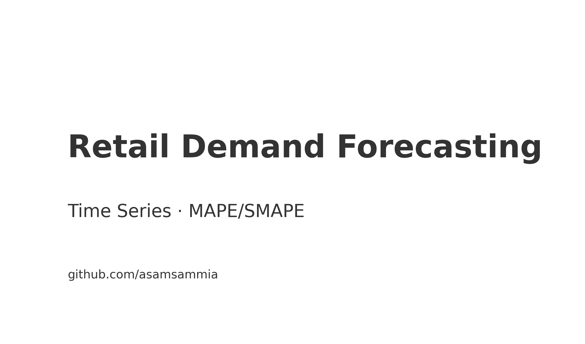
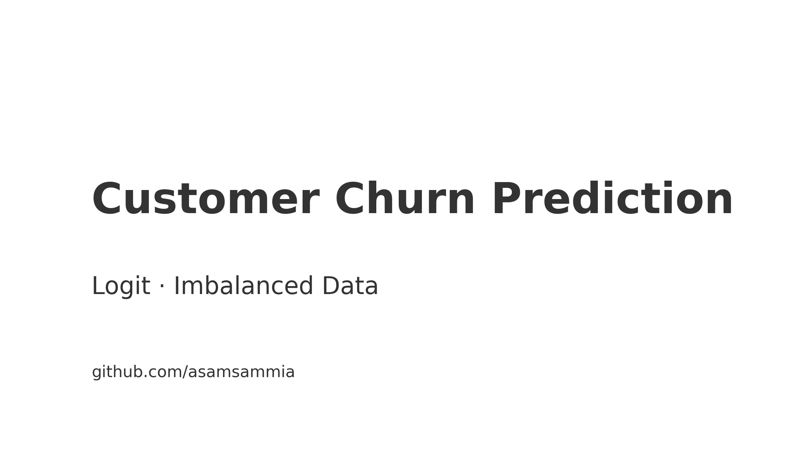
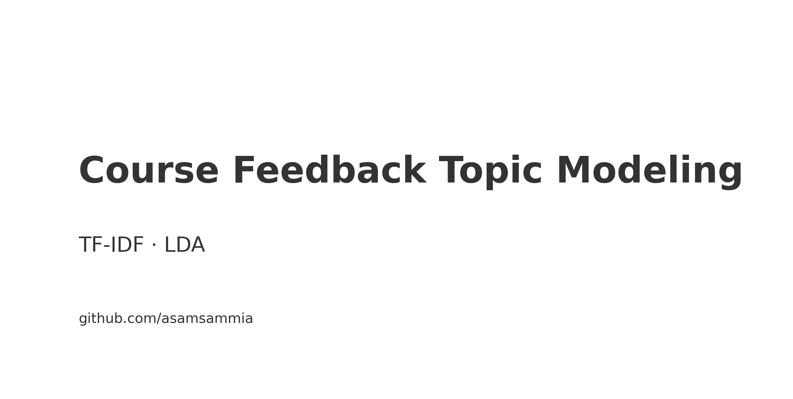

## 🎓 Academic Projects

<table>
  <tr>
    <td width="50%">
       
      <b>Retail Demand Forecasting (MS Capstone)</b> 
      Time-series demand · Naive baseline + metrics
    </td>
    <td width="50%">
       
      <b>Customer Churn Prediction</b> 
      Logistic regression with class-imbalance handling
    </td>
  </tr>
  <tr>
    <td width="50%">
       
      <b>SQL Cohort & LTV Analytics</b> 
      Cohort retention & lifetime value
    </td>
    <td width="50%">
       
      <b>Course Feedback Topic Modeling</b> 
      TF‑IDF + LDA on student feedback
    </td>
  </tr>
</table>
