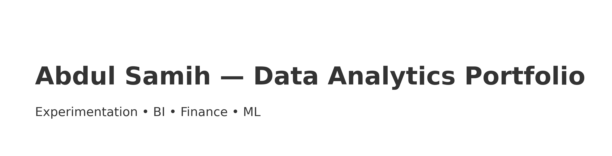

# Hi, I'm Abdul Samih 👋

Data Analyst (MS) focused on **experimentation, BI, and finance/risk analytics**. I turn messy data into
**clean KPIs** and **reproducible analytics repos** teams can run and trust.

**Now:** building A/B testing utilities, KPI dashboards, and risk/credit modeling mini-stacks.

---

## ⭐ Featured
- **A/B Testing Toolkit** — CUPED, uplift, guardrails · Python  
  Repo: [asamsammia/ab-testing-toolkit](https://github.com/asamsammia/ab-testing-toolkit)  
  _Quick start:_ `python smoke/quick_ab.py smoke/sample_ab.csv`

- **SQL Cohort & LTV Analytics** — funnel/retention/LTV with window fx · SQL  
  Repo: [asamsammia/sql-cohort-ltv-analytics](https://github.com/asamsammia/sql-cohort-ltv-analytics)  
  _Quick start:_ `python smoke/run_sql_demo.py`

- **Market Risk Mini** — scenario shocks + exposure scans · Python  
  Repo: [asamsammia/market-risk-mini](https://github.com/asamsammia/market-risk-mini)  
  _Quick start:_ `python src/run_scenarios.py --positions data/sample_positions.csv --scenario scenarios/base.json --out outputs.csv`

- **Real Estate KPI Dashboard** — arrears aging, lease expiries, NOI bridge · BI  
  Repo: [asamsammia/real-estate-kpis](https://github.com/asamsammia/real-estate-kpis)

### More
- **Mortgage Rate Prediction — FHFA 2023** — forward selection + 10-fold CV · R  
  Repo: [asamsammia/fhfa-mortgage-stepwise-R](https://github.com/asamsammia/fhfa-mortgage-stepwise-R)
- **Credit Default — Stepwise Logistic** — AIC, 10-fold CV, ROC/AUC · R  
  Repo: [asamsammia/credit-default-stepwise-R](https://github.com/asamsammia/credit-default-stepwise-R)

---

## Skills
SQL · Python · R · Power BI · Tableau · scikit-learn · statsmodels · pandas · numpy · Git

## Contact
- **GitHub:** https://github.com/asamsammia  
- **LinkedIn:** https://www.linkedin.com/in/abdulsamih-datapro/  
- **Email:** abdulsamih3@gmail.com
