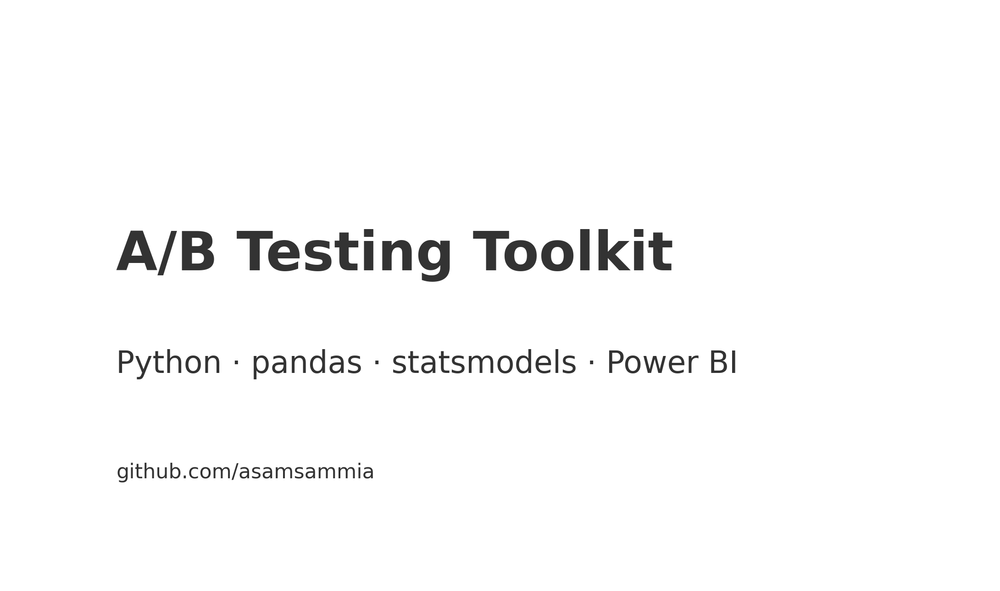
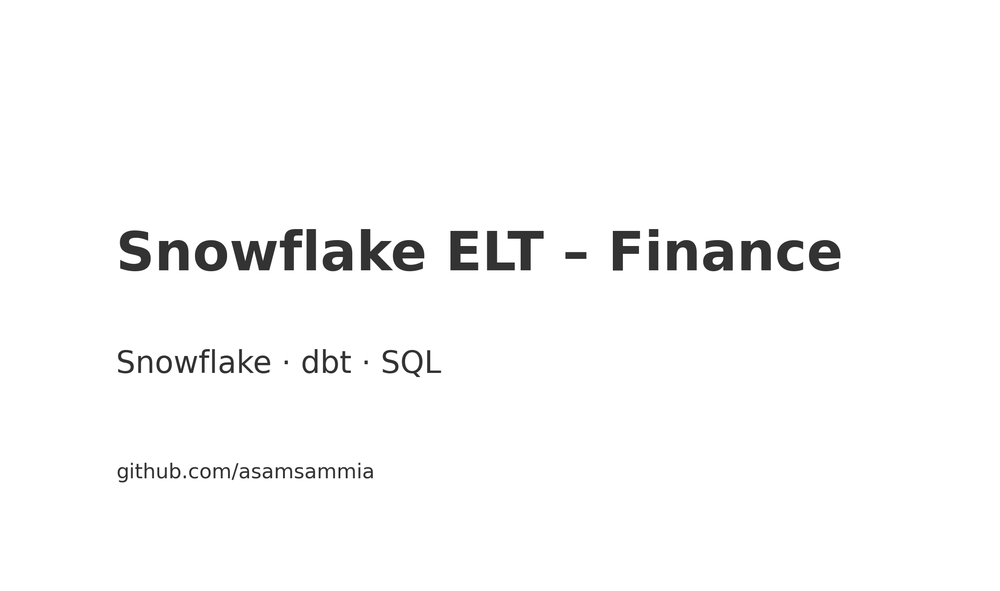
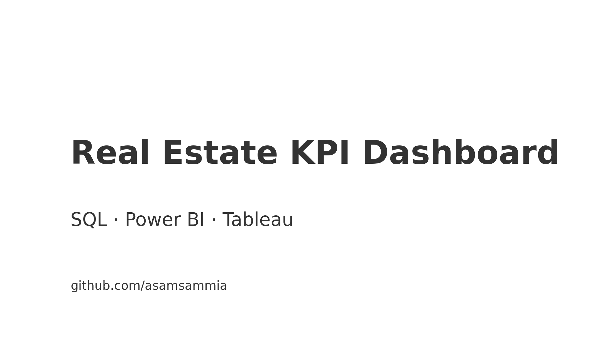
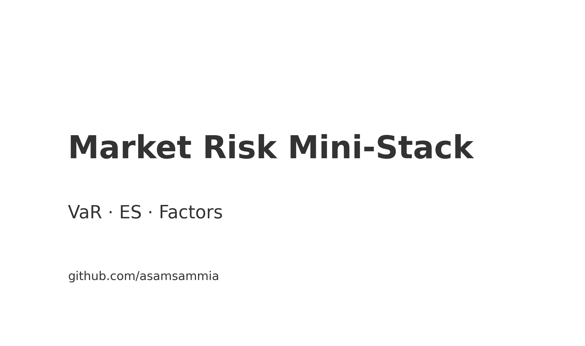
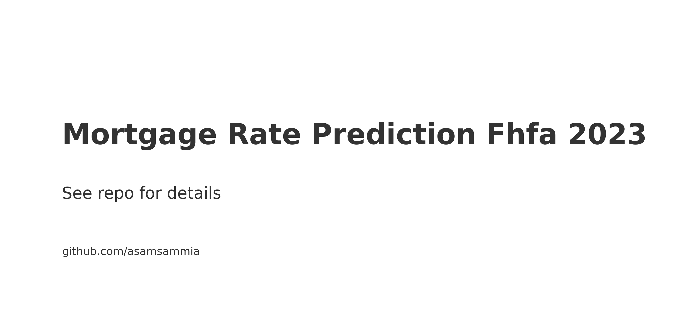
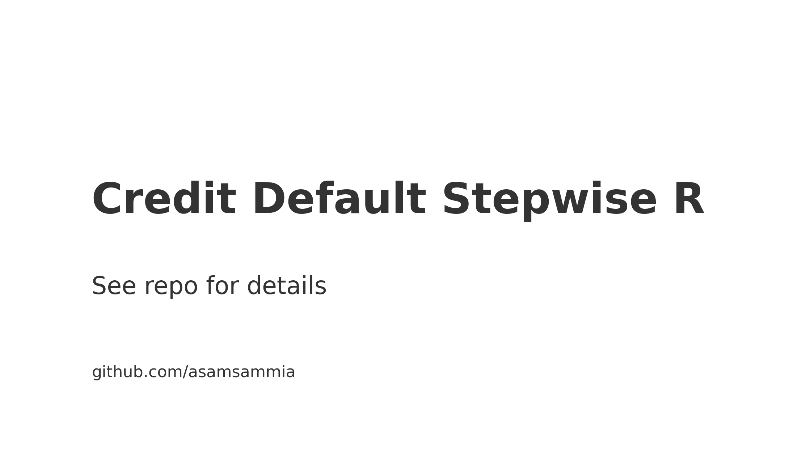

# Hi, I'm Abdul Samih 👋

Data Analyst (MS) focused on **experimentation, BI, and finance analytics**. I like turning messy data into
clean KPIs and simple, reproducible repos with 
.

**Now:** building A/B testing utilities, KPI dashboards, and risk/credit modeling mini-stacks.

---

## ⭐ Featured
<table>
  <tr>
    <td width="50%">
       
      <b>A/B Testing Toolkit</b> 
      CUPED · uplift · guardrails · pytest/flake8 

    </td>
    <td width="50%">
       
      <b>Snowflake ELT — Finance (dbt)</b> 
      ARR / Churn / CAC–LTV marts
    </td>
  </tr>
  <tr>
    <td width="50%">
       
      <b>Real Estate KPI Dashboard</b> 
      Arrears aging · lease expiries · NOI bridge
    </td>
    <td width="50%">
       
      <b>Market Risk Mini‑Stack</b> 
      VaR / ES · factor betas
    </td>
  </tr>
</table>

---

## 🎓 Academic Projects
<table>
  <tr>
    <td width="50%">
       
      <b>Retail Demand Forecasting (MS Capstone)</b> 
      Time-series demand · baseline + metrics
    </td>
    <td width="50%">
       
      <b>Customer Churn Prediction</b> 
      Logistic regression with class-imbalance handling
    </td>
  </tr>
  <tr>
    <td width="50%">
       
      <b>SQL Cohort & LTV Analytics</b> 
      Cohort retention & lifetime value
    </td>
    <td width="50%">
       
      <b>Course Feedback Topic Modeling</b> 
      TF‑IDF + LDA on student feedback
    </td>
  </tr>
</table>

---

## 🧪 Research
<table>
  <tr>
    <td width="50%">
       
      <b>Mortgage Rate Prediction — FHFA 2023</b> 
      Forward subset selection + 10‑fold CV (R)
    </td>
    <td width="50%">
       
      <b>Credit Default — Stepwise Logistic</b> 
      Forward/backward (AIC), 10‑fold CV, ROC/AUC (R)
    </td>
  </tr>
</table>

---

## Skills
**Languages/Tools:** SQL · Python · R · dbt · Snowflake · Power BI · Tableau · scikit‑learn · statsmodels  
**Focus:** Experimentation · KPI engineering · Financial analytics · Modeling & validation

## Contact
- **GitHub:** https://github.com/asamsammia  
- **LinkedIn:** https://www.linkedin.com/in/abdulsamih-datapro/  
- **Email:** abdulsamih3@gmail.com

---

> Tip: If images don’t render, ensure the folder is named **assets/** (not “assests”) and commit the PNGs.
